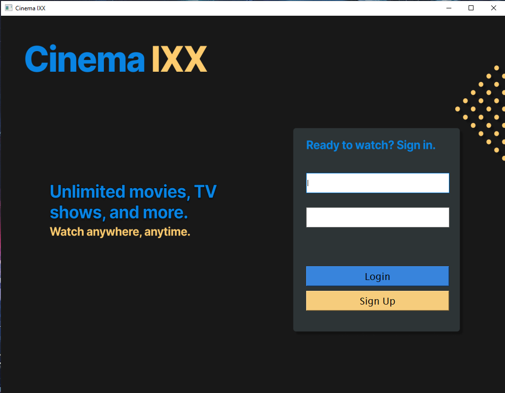
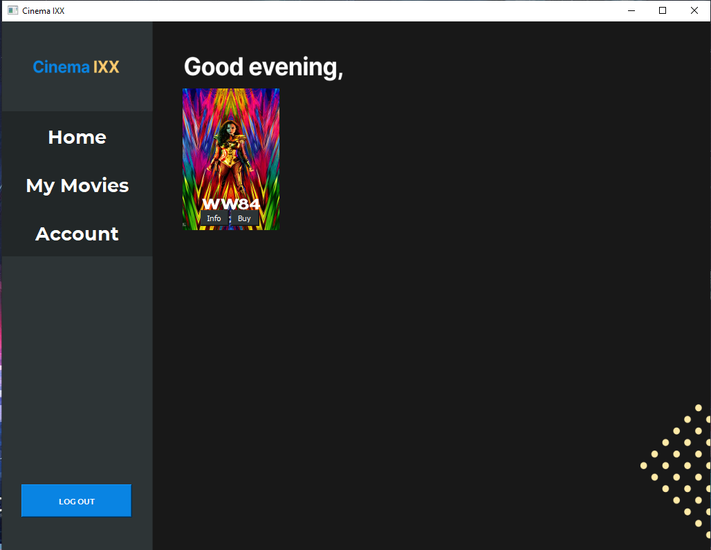
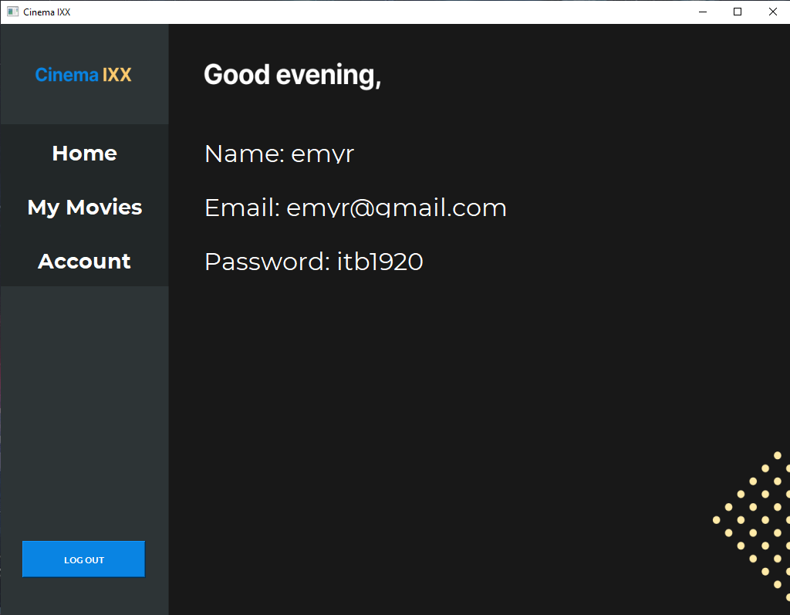
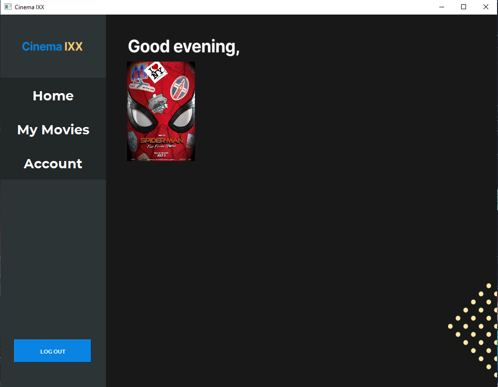
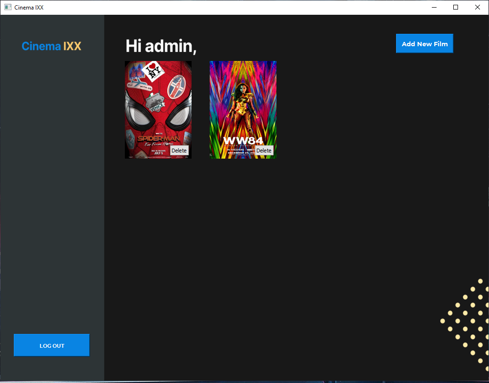
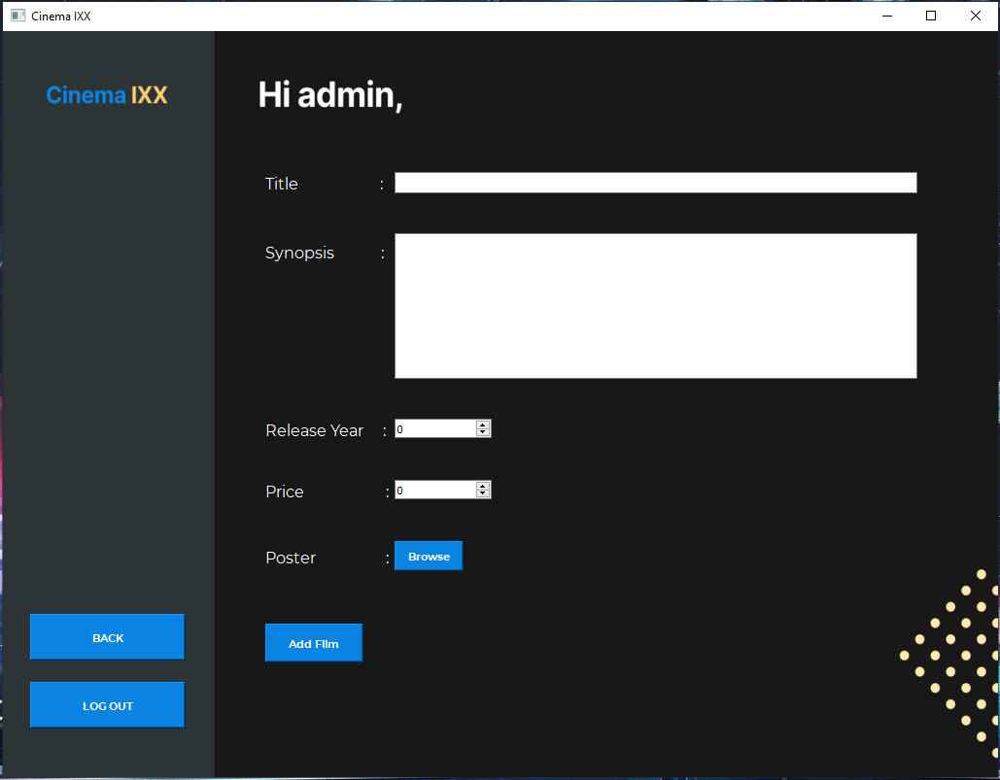

# IF2250-2021-K04-08-CinemaIXX

Implementasi Perancangan Perangkat Lunak CinemaIXX
IF2250 - Rekayasa Perangkat Lunak

## Penjelasan Program
Bioskop digital IXX adalah sebuah perangkat lunak desktop yang dapat digunakan  untuk membeli film. Terdapat dua jenis pengguna yang dapat mengakses perangkat lunak ini, yaitu admin dan customer/user. Dalam hal ini admin memiliki peran untuk melakukan penambahan ataupun penghapusan film, sedangkan user dapat melakukan berbagai hal seperti melihat daftar film yang disediakan oleh perangkat lunak beserta informasi film tersebut dan membeli film.

Dalam pembagiannya, fungsi utama perangkat lunak ini dapat terbagi menjadi 6, yaitu: proses login, logout, dan sign up, melihat daftar film beserta informasi terkait film tersebut, membeli film, melihat daftar film yang sudah dibeli oleh customer, melihat detail akun customer, dan penambahan dan penghapusan film yang tersedia oleh admin.

Untuk dapat menggunakan fitur dari perangkat lunak ini, customer perlu memiliki akun untuk login ke dalam perangkat lunak tersebut. Jika customer belum memiliki akun, maka dapat melakukan sign up untuk membuat akun baru. Customer/user hanya perlu menyiapkan email dan password untuk melengkapi proses registrasi akun ke sistem perangkat lunak tersebut. Customer juga dapat melakukan proses logout untuk keluar dari akunnya.

Setelah login berhasil, customer dapat melihat berbagai film yang tersedia di dalam perangkat lunak untuk dibeli. Sebelum customer membeli film, ia bisa melihat informasi dari film yang ingin dibeli meliputi judul, sinopsis, poster, tahun rilis, harga, dan jumlah total pembelian film.

Untuk melakukan pembelian film, customer/user harus melakukan pembayaran terlebih dahulu agar film tersebut terbeli oleh customer. Customer juga bisa melihat daftar film yang sudah ia beli sehingga tidak perlu mencari ke dalam daftar film yang tersedia. Selain itu, customer juga dapat melihat informasi akunnya.

Terakhir, admin dapat melakukan penambahan dan penghapusan film yang tersedia dalam perangkat lunak. Penambahan film dilakukan dengan mengisi judul, sinopsis, poster, tahun rilis, dan harga film.

## Cara Menjalankan Aplikasi
1. Install [python](https://www.python.org/downloads/)
2. Install dependency
```
pip install PyQt5
```
3. Buka folder [src](./src)
```
cd src
```
4. Jalankan [login.py](./src/login.py)
```
python login.py
```
## Daftar Modul
### Modul Autentikasi
Penanggung jawab : Muhammad Dehan Al Kautsar (13519200)

Modul autentikasi mencakup fungsi *login* dan *signup* customer dan admin

#### *Capture Screen*


### Modul Akses Film
Penanggung jawab : Ryo Richardo (13519193)

Modul akses film berisi fungsionalitas melihat semua film yang belum dibeli, melihat informasi film, dan membeli film

#### *Capture Screen*


### Modul Akun
Penanggung jawab : Andres Jerriel Sinabutar (13519218)

Modul akun berisi fungsionalitas melihat informasi akun dan melihat film yang sudah dibeli

#### *Capture Screen*



### Modul Admin
Penanggung jawab : Reyhan Emyr Arrosyid (13519167)

Modul admin berisi fungsionalitas menambahkan dan menghapus film dari database

#### *Capture Screen*



## Daftar Tabel Basis Data
### Tabel Akun
- Tabel Akun berisi data customer dan admin yang sudah bergabung dalam sistem
- Nama tabel: akun
- Atribut:
    - id: Merupakan pembeda akun, bertipe INTEGER
    - phoneNumber: Merupakan nomor telepon customer, bertipe TEXT
    - name: Merupakan nama pemilik akun, bertipe TEXT
    - email: Merupakan email customer atau admin, bertipe TEXT
    - password: Merupakan password akun, bertipe TEXT
    - role: Merupakan role akun, bertipe TEXT, nilainya ADMIN atau CUSTOMER

### Tabel Film
- Tabel Film berisi data film yang ada dalam sistem
- Nama tabel: film
- Atribut:
    - id: Merupakan pembeda film, bertipe INTEGER
    - judul: Merupakan judul film, bertipe TEXT
    - sinopsis: Merupakan sinopsis film, bertipe TEXT
    - tahun_rilis: Merupakan tahun rilis, bertipe INTEGER
    - poster: Merupakan poster film, bertipe BLOB
    - harga_film: Merupakan harga film, bertipe INTEGER
    - junlah_pembelian: Berisi banyak pembelian film, bertipe INTEGER

### Tabel Histori Pembelian
- Tabel Histori Pembelian berisi data riwayat pembelian semua akun dalam sistem
- Nama tabel: histori_pembelian
- Atribut:
    - id: Merupakan pembeda entri tabel, bertipe INTEGER
    - userId: Merupakan id user yang membeli film bertipe INTEGER
    - filmId: Merupakan id film yang dibeli user, bertipe INTEGER
